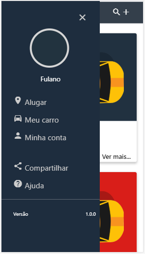

# Projeto APP-Carro
> Front-end de um aplicativo (sem-nome) de aluguel de carros/Projeto acadêmico.

![NPM Version][npm-image]

O sistema foi criado como projeto acadêmico, para conclusão da matéria de IHC do curso Análise e Desenvolvimento de Sistemas na Faculdade de Tecnologia de Itu, turma do 3º Semestre de 2018.
O objetivo da aplicação é permitir que o usuário alugue um carro em sua região ou alugue seu carro para alguém próximo, definindo seu próprio preço.

## Contato

Erick Trettel de Almeida – ericktrettel@gmail.com

[https://github.com/erickTrettel/projeto-app-carro](https://github.com/erickTrettel/projeto-app-carro)

<!-- Markdown link & img dfn's -->
[npm-image]: https://img.shields.io/badge/version-1.0.0-blue.svg
